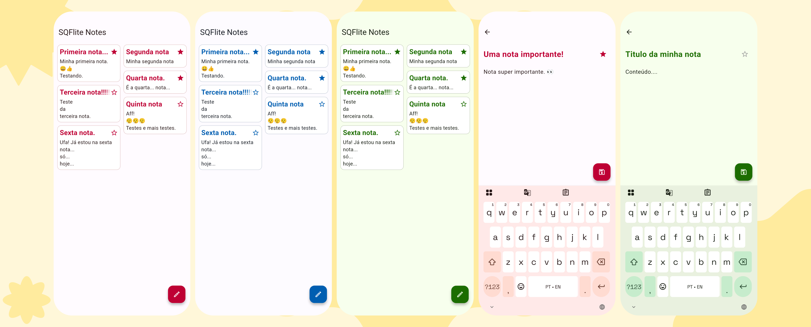

# SQFlite Notes
Criado por Daniel Pereira (dpnnl)

---

## 🇧🇷 Português

Com o SQFlite Notes você pode criar, editar e excluir notas simples; utiliza SQLite para salvar no dispositivo.

### ⚠️ Compatibilidade e UI
* Desenvolvido exclusivamente para Android
* Cores do tema se adaptam ao Material You!
* Utiliza SQLite/SQFlite, para salvar as notas em um banco de dados offline

### Flutter 💙
Desenvolvido com a versão do 3.35 do Flutter e 3.9 do Dart!

### Estado do Projeto
Pronto, para compilação e execução, testado no Android 16

---

## 🇺🇸 English

With SQFlite Notes you can create, edit, and delete simple notes; it uses SQLite to save them to your device.

### ⚠️ Compatibility and UI
* Developed exclusively for Android
* Theme colors adapt to Material You!

* Uses SQLite/SQFlite to save notes in an offline database

### Flutter 💙
Developed with Flutter version 3.35 and Dart version 3.9!

### Project Status
Ready for compilation and execution, tested on Android 16
